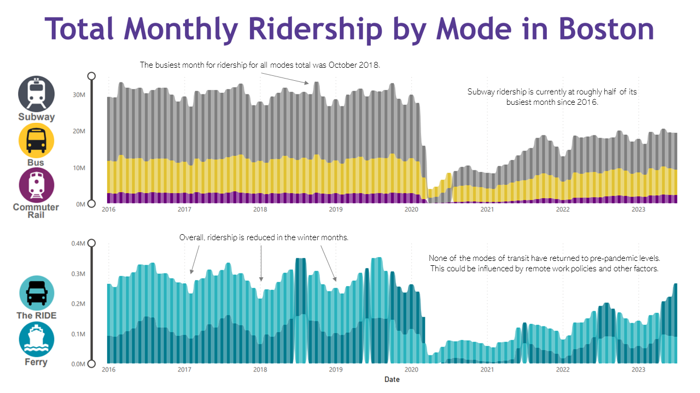

# Data Visualizations

## Amy's Timeline

{:target="_blank"}

## Boston's Transit Accessible Areas

{:target="_blank"}

## Boston's Busiest Morning Corridors

{:target="_blank"}

## MBTA Ridership Across Modes

{:target="_blank"}

## Ski Resorts I've Visited

{:target="_blank"}

---

[Back to Portfolio](/atibbetts)

---
For more details see [GitHub Flavored Markdown](https://guides.github.com/features/mastering-markdown/).
